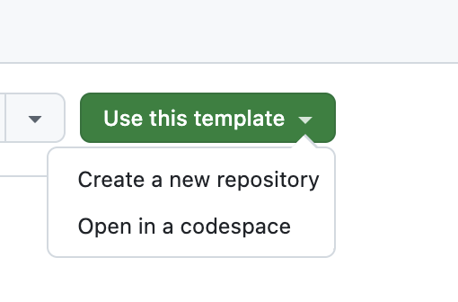
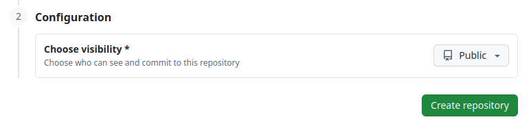

# Tinkercademy Bootcamp 2026 - Coding Labs

This repository was cloned from [Stanford CS106L](https://web.stanford.edu/class/cs106l/), a course on Standard C++ programming. All credit for the original starter code and assignment design goes to the CS106L course staff.

The assignments here have been modified from the original course materials.

## Prerequisites

You need:

- **`g++` with C++20 support** (gcc 10+, ideally 13+; or clang 15+).
  - **macOS:** `brew install gcc`, then make sure `g++` resolves to the Homebrew version (e.g. `g++-14`), not Apple's `clang` alias.
  - **Linux (Debian/Ubuntu):** `sudo apt-get install g++` (verify `g++ --version` is 10 or higher).
  - **Windows:** install the [MinGW-w64 toolchain](https://code.visualstudio.com/docs/cpp/config-mingw).
- **`git`** — install from <https://git-scm.com/downloads> if `git --version` doesn't work.
- An editor. **VSCode** with the **C/C++** extension works well, but anything will do.

## Getting Started

Create your own private repository with the "Use this template" button, followed by "Create new repository".


Make sure it is **private**.


Clone this repository:

```sh
git clone git@github.com:tinkercademy-bootcamp/2026-coding-labs.git
cd 2026-coding-labs
git remote add -t main -f upstream https://github.com/tinkercademy-bootcamp/2026-coding-labs.git
```
(Replace file paths with your respective repository name. If your GitHub username was `tk-machine-user` and your repository was named `2026-cpp-bootcamp`, the commands would be:
```sh
git clone git@github.com:tk-machine-user/2026-cpp-bootcamp.git
cd 2026-cpp-bootcamp
git remote add -t main -f upstream https://github.com/tinkercademy-bootcamp/2026-coding-labs.git # this line doesn't change
```
)

Each assignment has its own `README.md` with build and run instructions. To pull updates later:

```sh
git pull upstream main
```
