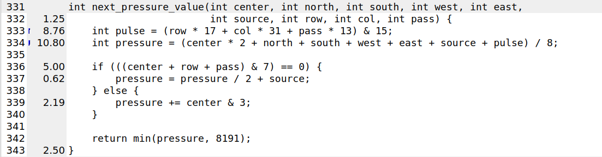

# Intro Profiling Lab

This lab is a guided introduction to profiling a C++ program. The goal is not
to optimize immediately. The goal is to learn how to move from "this program
feels slow" to a specific explanation backed by profiler evidence.

## Before You Start

Run the installer before starting the lab so the required tools are available:

```bash
bash install_profilers.sh
```

This installs or configures the tools used in the walkthrough, including
`perf`, `gprof`, Valgrind, Callgrind, KCachegrind, and FlameGraph.

## How To Use This Lab

This README is structured as a guided walkthrough. It introduces the program,
then takes you step by step through different profiling methods with commands,
examples, and deeper explanations of what each tool is showing.

Use the walkthrough as a starting point, not as a limit. You are encouraged to
inspect more profiler output, try extra tool options, compare results, and dig
deeper into anything that looks interesting or confusing.

Some sections include questions. Only questions explicitly numbered with a
`Q`, such as `Q2.1`, must be answered in your final `report.md`. Other
questions in the README are guiding questions to help you think while working
through the lab; you do not need to answer every one of those in the report.

## The Program

This lab uses one C++ file: `grid_bfs.cpp`.

- The program builds a deterministic `260 x 260` grid in memory.
- It generates `1200` fixed route requests between open grid cells.
- It runs breadth-first search (BFS) for each route request.
- While BFS runs, it records how often each grid cell is visited.
- After BFS, it summarizes the heatmap and runs an iterative
  congestion-pressure pass over it.
- The congestion-pressure pass models how traffic pressure spreads to
  neighboring cells.
- The final output is intentionally compact: route counts, average distance,
  checksums, heatmap values, congestion values, and total runtime.

## How The Code Fits Together

Start reading from `main`.

- `generate_grid` builds the blocked/open-cell map using a fixed seed.
- `generate_requests` chooses deterministic start and goal points.
- `run_all_requests` loops over all route requests and calls
  `shortest_path_bfs`.
- `shortest_path_bfs` is the main BFS search routine. It also updates the
  shared heatmap.
- `summarize_heatmap` computes basic statistics from the heatmap.
- `compute_congestion_pressure` repeatedly transforms the heatmap into a
  congestion-pressure map.
- `print_summary` prints the final compact report.

## Build And Run First

Before using a profiler, run the program normally.

```bash
cd lab1
make all
taskset -c 0 ./grid_bfs
```

- Read the output. Do not skip this step.
- A profiler tells you where time went, but it does not tell you what the
  program is supposed to mean.
- Try to understand what the program actually computes.
- The checksum fields are there to verify your outputs after doing any
  optimizations.

## Measure Runtime Without A Profiler

Start with the simplest possible measurement: how long the program takes to
run.

```bash
time taskset -c 0 ./grid_bfs
```

- `time` is placed before `taskset` because we want to measure the whole
  command that actually runs the pinned program.
- In this command, `taskset -c 0 ./grid_bfs` is the command being timed.

#### Example output

```text
real	0m1.729s
user	0m1.621s
sys     0m0.099s
```

### Report Questions: Runtime Measurement

- **Q1.1:** In the `time` command output, why does `user + sys` not always
  equal `real`?

At this stage, ask basic questions:

- Does the run take long enough that profiling will have something to measure?
- Is most of the time in `user`?
- Is `sys` small compared with `user`, or is the program spending a surprising
  amount of time in the operating system?

## Pin The Program To One CPU

Most commands in this lab use `taskset -c 0`.

```bash
taskset -c 0 ./grid_bfs
```

- `taskset` controls CPU affinity.
- `-c 0` means "run this command on CPU number 0".
- This makes measurements easier to compare because the operating system is
  less likely to move the program between different CPUs while it runs.
- CPU `0` is used here because it exists even on single-core target machines.
- CPU `0` is not magic; the important idea is to pick one CPU and use the same
  one consistently for all runs.
- On a multi-core machine, it can sometimes be better to avoid CPU `0` because
  it may be busier with operating-system housekeeping, timer interrupts, and
  other background work.
- This is especially useful on machines with different kinds of cores, such as
  Intel systems with P-cores and E-cores.
- If the program moves between core types, `perf` may show separate event
  sections such as `cpu_core/cycles` and `cpu_atom/cycles`.
- That makes the report harder to read because the samples are split across
  multiple CPU event groups.
- Pinning the run with `taskset` keeps the workload on one CPU, so the `perf`
  output is more uniform.

## What `perf` Is

`perf` is a Linux profiler. It can answer two different kinds of questions:

- Whole-program questions: how many cycles, instructions, branches, or cache
  events happened?
- Hot-path questions: which functions were running when samples were collected?

You will use three `perf` commands in this lab:

- `perf stat`: count events for the whole program.
- `perf record`: collect sampled profiling data into `perf.data`.
- `perf report`: inspect the recorded profile.

The general syntax is:

```bash
taskset -c 0 perf <subcommand> [options] ./program
```

For example, `taskset -c 0 perf stat ... ./grid_bfs` means "pin the run to CPU
0, then use the `stat` subcommand on the `./grid_bfs` program".

## Ask Whole-Program Questions With `perf stat`

Start with `perf stat`. This does not tell you which function is slow. It gives
you a whole-program summary.

```bash
taskset -c 0 perf stat -e cycles,instructions,branches,branch-misses,cache-references,cache-misses,L1-dcache-loads,L1-dcache-load-misses ./grid_bfs
```

Command pieces:

- `perf stat` means "run the program and count events".
- `taskset -c 0` keeps the run on CPU 0 so the measurement is more stable.
- `-e` means "measure these specific events".
- `./grid_bfs` is the program being measured.
- We use an explicit event list because plain `perf stat ./grid_bfs` is not
  reliable on the target machine.
- On the target machine, plain `perf stat` may try to collect a default metric
  called `slots`.
- `slots` is a hardware-specific top-down performance metric. It estimates how
  much issue/retirement capacity the CPU had available while the program ran.
- That metric depends on CPU model support, kernel support, and how `perf`
  maps events on the machine.
- If `perf` cannot read or schedule the `slots` event correctly, the default
  `perf stat` command can fail before giving a useful report.
- By passing `-e cycles,instructions,...`, we avoid that fragile default metric
  set and ask for basic events that are supported more reliably.

Events in this command:

- `cycles`: rough measure of CPU work.
- `instructions`: number of CPU instructions completed.
- `branches` and `branch-misses`: control-flow activity.
- `cache-references` and `cache-misses`: overall cache activity.
- `L1-dcache-loads` and `L1-dcache-load-misses`: L1 data-cache load activity.
- `seconds time elapsed`: wall-clock runtime.

#### Example Output:
```
Performance counter stats for './grid_bfs':

       4697502608      cycles                                                                  (37.45%)
      16596146890      instructions                     #    3.53  insn per cycle              (37.47%)
       1971849636      branches                                                                (37.51%)
         90001887      branch-misses                    #    4.56% of all branches             (25.04%)
       4353511908      cache-references                                                        (25.05%)
        390722434      cache-misses                     #    8.97% of all cache refs           (24.94%)
       4341884735      L1-dcache-loads                                                         (25.02%)
        385084363      L1-dcache-load-misses            #    8.87% of all L1-dcache accesses   (24.98%)

      1.809529887 seconds time elapsed

      1.672736000 seconds user
      0.119623000 seconds sys
```

Do not try to explain everything from this one command. Use it to form first
hypotheses:

- Are cache misses noticeable?
- Are branch misses noticeable?
- Does anything look surprising enough to investigate further?

### Report Questions: `perf stat`

- **Q2.1:** In `perf stat`, how are event counts and derived metrics such as
  `insn per cycle`, `% of all branches`, and `% of all cache refs` calculated?
- **Q2.2:** What do the right-side percentages in parentheses mean in
  `perf stat`, for example `(24.94%)`?
- **Q2.3:** Is a number like `390722434 cache-misses` always the exact number
  of cache misses? Explain why or why not.

## Find Hot Functions With `perf record`

`perf stat` tells you that work happened. It does not tell you where. For that,
collect samples.

First rebuild with frame pointers:

```bash
make perf
```

This runs the `perf` target in the `Makefile`. The actual compiler command is:

```bash
g++ -std=c++20 -Wall -Wextra -pedantic -O2 -g -fno-omit-frame-pointer grid_bfs.cpp -o grid_bfs
```

Key flags:

- `-O2`: build optimized code. Profiling an unoptimized debug build can point
  you at costs that will not exist in a normal optimized build.
- `-g`: include debug symbols. This helps `perf` show function names and source
  locations instead of only raw addresses.
- `-fno-omit-frame-pointer`: required for this lab's stack-profiling build.
- `-Wall -Wextra -pedantic`: enable compiler warnings. These are not profiling
  flags, but they help keep the code clean.

### Report Questions: Call Stacks

- **Q3.1:** What are frame pointers, and how does `perf -g` use them to
  reconstruct call stacks?

Now record a profile:

```bash
taskset -c 0 perf record -g ./grid_bfs
```

Command pieces:

- `perf record` collects samples while the program runs.
- `taskset -c 0` keeps the profiled run on CPU 0.
- `-g` records call stacks, so you can see not only where samples landed, but
  also how the program reached that function.
- `./grid_bfs` is the program being profiled.
- By default, `perf record` writes the profile to a file named `perf.data`.

Sampling means `perf` interrupts the program many times and asks, "where are
you right now?" A function that appears in many samples probably consumed a lot
of time.

Now inspect the profile:

```bash
perf report -i perf.data --stdio
```

Command pieces:

- `perf report` reads a recorded profile.
- `-i perf.data` tells it to read the profile file produced by
  `perf record`.
- `--stdio` prints a text report

Optional: save the report to a text file if you want to scroll through it more
comfortably.

```bash
perf report -i perf.data --stdio > perf.txt
```

How the report is organized:

- The top of the report shows metadata, such as the event being sampled and the
  number of samples collected.
- The main table has these columns: `Children`, `Self`, `Command`,
  `Shared Object`, and `Symbol`.
- `Command` is the process name, which should be `grid_bfs` here.
- `Shared Object` tells you where the sampled code came from, such as
  `grid_bfs`, `libc.so.6`, `libstdc++.so`, or `[kernel.kallsyms]`.
- `Symbol` is the function or kernel symbol where samples were attributed.
- Lines starting with tree-like markers such as `---`, `|--`, or indentation
  are call-stack information.

### Report Questions: Cost Attribution

- **Q3.2:** What is the difference between inclusive cost and self cost in
  `perf report`, `gprof`, or Callgrind?

#### Ordering Of Entries In `perf`

- The top-level rows are usually sorted by `Children`.
- The indented call-stack entries under a row are not a separate global ranking
  of the whole program.
- Those indented entries are local context for the selected top-level symbol.
- Within that local context, larger percentage branches are usually shown
  before smaller ones.

#### Caller And Callee Context

A report entry can show both caller context and callee context around the same
function.

For example, you may see something shaped like this:

```text
60.75%    42.57%  grid_bfs  grid_bfs  [.] compute_congestion_pressure(...)
            |
            |--42.57%--_start
            |          __libc_start_main@@GLIBC_2.34
            |          __libc_start_call_main
            |          main
            |          compute_congestion_pressure(...)
            |
             --18.19%--compute_congestion_pressure(...)
                       |
                        --18.12%--next_pressure_value(...)
```

Practice reading it like this:

- To tell caller context from callee context, look for where the selected
  function appears inside the branch.
- If the selected function appears at the bottom of the branch, the lines above
  it are caller context.
- If the selected function appears at the top of the branch, the lines below it
  are callee context.
- If the selected function appears in the middle, the lines above are callers
  and the lines below are callees.
- One branch should be read as `_start -> __libc_start_main -> main ->
  compute_congestion_pressure`.
- It does not mean `compute_congestion_pressure` called `main`.
- Another branch shows callee context below `compute_congestion_pressure`.

#### Per-Function Summary Rows

`perf report` also gives sampled functions their own summary rows.

- A helper function can appear inside a larger call stack near the top of the
  report.
- The same helper can also appear later as its own top-level symbol row.
- The top-level row is the grouped summary for that function across the whole
  run.
- The call stack under that row explains where samples inside that function
  came from.
- For example, `in_bounds` may appear inside the `shortest_path_bfs` call path,
  and later also appear as its own row:

```text
3.02%     3.02%  grid_bfs  grid_bfs  [.] in_bounds(int, int, int, int)
            |
            ---_start
               __libc_start_main@@GLIBC_2.34
               __libc_start_call_main
               main
               run_all_requests(...)
               shortest_path_bfs(...)
               in_bounds(int, int, int, int)
```

Read the stack below it as the path `main ->
  run_all_requests -> shortest_path_bfs -> in_bounds`.

Look for:

- Functions with high `Children` or `Self` percentages.
- Whether `shortest_path_bfs` is a major hotspot.
- Whether `compute_congestion_pressure` is also visible.
- Whether library functions like `memset`, `malloc`, or `operator delete`
  appear.

Use both `Children` and `Self` when deciding which functions deserve closer
inspection.

Do not over-interpret tiny percentages. Sampling is strongest for finding the
large, repeated costs.

## Turn The Same Profile Into A FlameGraph

A FlameGraph is a visual view of the same sampled call stacks. It does not
measure anything new. It makes the profile easier to scan visually.

Generate it from the same `perf.data`:

```bash
perf script -i perf.data > perf.script
~/FlameGraph/stackcollapse-perf.pl perf.script > perf.folded
~/FlameGraph/flamegraph.pl perf.folded > flamegraph.svg
```

Command pieces:

- `perf script -i perf.data` converts the recorded profile file into readable
  stack samples.
- `stackcollapse-perf.pl` converts stack samples into FlameGraph input format.
- `flamegraph.pl` creates the final SVG.

How to read the FlameGraph:

- Each rectangle is a function.
- Wider rectangles mean more samples passed through that function.
- The vertical direction shows call-stack depth.
- The horizontal order is not time order.

Compare the FlameGraph with `perf report`:

- Do the same big functions appear?
- Is BFS visually wide?
- Is the congestion-pressure phase visually wide?
- Are there smaller library costs that were harder to notice in the table?

## Compare With `gprof`

`gprof` is an older profiler that gives a different view of function cost.

The important difference is that `gprof` changes the build. It requires `-pg`,
so you are no longer measuring exactly the same binary as the `perf` build.

```bash
make gprof
taskset -c 0 ./grid_bfs
gprof ./grid_bfs gmon.out > gprof.txt
```

Command pieces:

- `make gprof` rebuilds the program for `gprof`.
- Running `taskset -c 0 ./grid_bfs` creates `gmon.out`.
- `gprof ./grid_bfs gmon.out > gprof.txt` reads the binary and profile data,
  then writes the report into `gprof.txt`.

The `make gprof` target runs this compiler command:

```bash
g++ -std=c++20 -Wall -Wextra -pedantic -O0 -g -pg grid_bfs.cpp -o grid_bfs
```

Key flags:

- `-O0`: disables optimization. This keeps the call graph closer to the source
  code, which makes the report easier to read.
- `-g`: includes debug symbols, so function names and source-level information
  are easier for tools to recover.
- `-pg`: builds the program in the mode required for this `gprof` run.

Why use `-O0` here:

- `gprof` is sensitive to compiler optimization.
- With `-O2`, the compiler may inline small functions, move code around, or
  merge/split work in ways that make the call graph confusing.
- With `-O2`, `gprof` can make call relationships harder to explain, especially
  in modern C++ code with templates and small helper functions.
- `-O0` is slower, but it gives a more readable teaching report.
- This means the `gprof` run is not the same performance experiment as the
  optimized `perf` run.

Open the report:

```bash
less gprof.txt
```

### Flat Profile

The first important section is the flat profile. Use it to identify functions
worth investigating further.

#### Flat Profile Example

```text
Each sample counts as 0.01 seconds.
  %   cumulative   self              self     total
 time   seconds   seconds    calls   s/call   s/call  name
 26.73      2.67     2.67        1     2.67     5.78  compute_congestion_pressure(std::vector<int, std::allocator<int> > const&, int, int)
 15.82      4.25     1.58     1200     0.00     0.00  shortest_path_bfs(std::vector<std::__cxx11::basic_string<char, std::char_traits<char>, std::allocator<char> >, std::allocator<std::__cxx11::basic_string<char, std::char_traits<char>, std::allocator<char> > > > const&, RouteRequest const&, std::vector<int, std::allocator<int> >&)
 12.71      5.52     1.27 1668791048     0.00     0.00  std::vector<int, std::allocator<int> >::operator[](unsigned long)
 11.61      6.68     1.16 272646144     0.00     0.00  next_pressure_value(int, int, int, int, int, int, int, int, int)
```

Be careful with the time values:

- These seconds are `gprof`'s attributed sampled time, not necessarily the exact
  wall-clock time you saw from `time`.
- A `gprof` run can be much slower because `-pg` instrumentation adds overhead.
- That overhead is especially painful when small functions are called hundreds
  of millions of times.
- Use these numbers to understand relative cost and call structure, not as the
  final runtime measurement.

### Call Graph

The second important section is the call graph. It shows how functions call
each other.

#### Call Graph Example

```text
-----------------------------------------------
                1.16    0.31 272646144/272646144     compute_congestion_pressure(std::vector<int, std::allocator<int> > const&, int, int) [2]
[5]     14.7    1.16    0.31 272646144         next_pressure_value(int, int, int, int, int, int, int, int, int) [5]
                0.31    0.00 272646144/272646144     int const& std::min<int>(int const&, int const&) [13]
```

The call graph is organized in blocks:

- Caller lines appear above the indexed function row.
- The indexed row is the function currently being explained.
- Callee lines appear below the indexed function row.
- Dashed lines separate one function block from the next.

How to read the example:

- `compute_congestion_pressure` is the caller of `next_pressure_value`.
- `[5]` is the report index for `next_pressure_value`.
- `272646144` is the number of calls to `next_pressure_value`.
- `272646144/272646144` means all calls to `next_pressure_value` came from this
  caller in this report.
- `std::min` is shown below because `next_pressure_value` calls it.

The header for this section may include a line like:

```text
granularity: each sample hit covers 4 byte(s) for 0.10% of 9.99 seconds
```

Read that as:

- `gprof` collected samples at a fixed interval.
- Each sample is only an approximation of where time went.
- The `9.99 seconds` value is the sampled/accounted time in the `gprof` report.
- It is not guaranteed to equal the wall-clock runtime from `time`.

### Report Questions: `gprof`

- **Q4.1:** How is `gprof` able to give function call counts and the number of
  times one function is called by another? Give a high-level explanation of how
  it works under the hood.
- **Q4.2:** If `perf` and FlameGraphs give strong runtime hotspot data, why use
  `gprof` in this lab?

Use `gprof` as a comparison tool, not as the first source of truth.

Ask:

- Does `gprof` agree that BFS and congestion processing are important?
- Do call counts make any repeated helper functions easier to understand?
- Are there functions that `perf` barely showed but `gprof` makes visible?
- Where do the two tools disagree?

For this lab, the recommended order is `perf` first, then `gprof`.

## Check Memory Correctness With Valgrind

Performance numbers are not enough if the program is wrong. Valgrind can check
for memory errors and leaks.

High-level idea:

- Valgrind runs your program under a dynamic instrumentation engine.
- Your binary is not executed directly by the CPU in the usual way.
- Valgrind translates chunks of machine code into an internal representation.
- It adds extra checking code around memory operations and allocator calls.
- Then it executes the instrumented version of the program.
- This is why Valgrind does not require recompilation: it can instrument an
  already-built executable while it runs.
- The main drawback is speed: Valgrind can make programs much slower because it
  is checking memory behavior instruction by instruction.
- Use Valgrind for correctness evidence, not for realistic runtime
  measurement.

For this lab, we mainly use Valgrind's Memcheck tool.

- Memcheck can detect invalid reads, invalid writes, use of uninitialized
  values, and memory leaks.
- For leak detection, it intercepts heap allocation and deallocation calls such
  as `malloc`, `free`, `new`, `delete`, `new[]`, and `delete[]`.
- When the program allocates memory, Valgrind records the address, size,
  allocation stack trace, and whether that block has been freed.
- When the program frees memory, Valgrind marks that block as freed.
- At program exit, Valgrind checks which allocated heap blocks were never
  freed.
- It also checks whether those blocks are still reachable from live pointers.

Common leak categories:

- `definitely lost`: no pointer to the block exists anymore. This is a real
  leak.
- `indirectly lost`: the leaked block was only reachable from another leaked
  block.
- `possibly lost`: Valgrind found a pointer into the middle of the block, but
  not clearly to the start.
- `still reachable`: the block was not freed, but a pointer to it still exists
  at exit. This is often less severe.

The key mechanism is:

```text
Valgrind tracks heap allocations and frees, then scans reachable memory at exit
to see which allocated blocks can still be reached by pointers.
```

### Report Questions: Memory Debugging Tools

- **Q5.1:** Compare Valgrind Memcheck and AddressSanitizer. When would you use
  each one?

Build a debug version:

```bash
make debug
```

The `make debug` target runs this compiler command:

```bash
g++ -std=c++20 -Wall -Wextra -pedantic -O0 -g grid_bfs.cpp -o grid_bfs
```

Key flags:

- `-O0`: disables optimization. This keeps the generated machine code closer to
  the source code, which makes memory-error reports easier to connect back to
  the program.
- `-g`: includes debug symbols. Valgrind can use these symbols to show more
  useful function names and source locations.
- `-Wall -Wextra -pedantic`: enable compiler warnings. These are not Valgrind
  flags, but they help catch suspicious code before runtime.

Why use a debug build here:

- Valgrind is looking for correctness issues, not peak optimized performance.
- A debug build makes stack traces easier to understand.
- Optimized builds can inline, reorder, or remove code in ways that make memory
  reports harder for beginners to map back to the source.

Start with the small deterministic path:

```bash
taskset -c 0 valgrind --leak-check=full --show-leak-kinds=all --track-origins=yes ./grid_bfs --test
```

Then run the smaller real workload:

```bash
taskset -c 0 valgrind --leak-check=full --show-leak-kinds=all --track-origins=yes ./grid_bfs --small
```

The `--small` option still runs the normal workload path, but with fewer route
requests and fewer congestion passes. This is useful because Valgrind is very
slow, and the full program can take a long time to finish under Valgrind.

If you really need to inspect the full workload, you can run:

```bash
taskset -c 0 valgrind --leak-check=full --show-leak-kinds=all --track-origins=yes ./grid_bfs
```

Expect the full Valgrind run to be much slower than a normal run.

Command pieces:

- `--leak-check=full` asks Valgrind to report detailed leak information.
- `--show-leak-kinds=all` shows all leak categories.
- `--track-origins=yes` gives more detail for uninitialized-value reports.
- `--test` runs only the tiny BFS sanity-check path.
- `--small` runs a reduced version of the real workload so Valgrind finishes
  faster.

### Reading The Valgrind Report

The top of the report tells you which tool is running and which command it
checked.

```text
==66277== Memcheck, a memory error detector
==66277== Command: ./grid_bfs --small
```

The program output appears next. This is useful because it confirms which
workload actually ran.

```text
requests = 25
congestion_passes = 32
time_sec = 16.8629
```

The `time_sec` value is much larger than a normal run because Valgrind is
instrumenting memory operations while the program runs.

The heap summary gives a high-level view of allocation behavior.

```text
==66277== HEAP SUMMARY:
==66277==     in use at exit: 8,450,000 bytes in 50 blocks
==66277==   total heap usage: 10,695 allocs, 10,645 frees, 14,694,128 bytes allocated
```

Read this as:

- `in use at exit`: memory still allocated when the program ended.
- `allocs`: number of heap allocation calls observed by Valgrind during the
  whole run. This means allocator-level calls such as `malloc`, `calloc`,
  `realloc`, `new`, and `new[]`.
- `frees`: number of heap deallocation calls observed by Valgrind during the
  whole run. This means allocator-level calls such as `free`, `delete`, and
  `delete[]`.
- These are not the same as operating-system system calls. A `malloc` or `new`
  call may reuse memory already managed by the allocator, or it may eventually
  request more memory from the OS.
- `bytes allocated`: total amount of heap memory requested across all
  allocations during the run. This is cumulative, not peak memory usage.
- `total heap usage`: a compact summary of all heap allocator activity.
- If `allocs` is greater than `frees`, some allocations were not released.

The most important part is the leak record. Valgrind groups similar leaks
together.

```text
==66277== 1,690,000 bytes in 25 blocks are definitely lost in loss record 1 of 2
==66277==    at 0x48485C3: operator new[](unsigned long)
==66277==    by 0x10BF40: shortest_path_bfs(...) (grid_bfs.cpp:198)
==66277==    by 0x10C474: run_all_requests(...) (grid_bfs.cpp:265)
==66277==    by 0x10D6F5: main (grid_bfs.cpp:491)
```

Read this as:

- `definitely lost` means Valgrind cannot find any live pointer to this memory.
  Treat this as a real memory leak.
- `1,690,000 bytes in 25 blocks` means this allocation pattern leaked 25 times.
- `operator new[]` tells you the leaked memory came from a dynamic array
  allocation.
- The stack trace shows where the allocation happened.
- The most useful source line is `shortest_path_bfs(...) (grid_bfs.cpp:198)`.
- The later lines show how the program reached that allocation:
  `main -> run_all_requests -> shortest_path_bfs`.

There may be multiple leak records:

```text
==66277== 6,760,000 bytes in 25 blocks are definitely lost in loss record 2 of 2
==66277==    by 0x10BF29: shortest_path_bfs(...) (grid_bfs.cpp:196)
```

This means there is another leaked allocation, also inside
`shortest_path_bfs`, but at a different source line.

The leak summary is the final checklist.

```text
==66277== LEAK SUMMARY:
==66277==    definitely lost: 8,450,000 bytes in 50 blocks
==66277==    indirectly lost: 0 bytes in 0 blocks
==66277==      possibly lost: 0 bytes in 0 blocks
==66277==    still reachable: 0 bytes in 0 blocks
==66277==         suppressed: 0 bytes in 0 blocks
```

Key points to inspect:

- Check `definitely lost` first. Nonzero `definitely lost` memory is a real
  leak.
- Check how many blocks leaked. Here, `50 blocks` suggests repeated leakage,
  not one isolated allocation.
- Check the allocation stack trace. The first source line in your code is
  usually the best starting point.
- Check whether multiple leak records point to nearby lines. Here, both leaks
  point into `shortest_path_bfs`.
- Compare the number of leaked blocks with program behavior. In the `--small`
  run, there are `25` route requests and each leak record has `25 blocks`.
- That strongly suggests one leaked allocation per reachable BFS request for
  each of the two arrays allocated inside `shortest_path_bfs`.
- After fixing the bug, rerun the same Valgrind command and expect
  `definitely lost: 0 bytes in 0 blocks`.

This is a different skill from finding a hotspot. A program can be fast and
still be incorrect.

## Use Callgrind For Deeper Structure

Valgrind also has a heavier profiling tool called Callgrind. It is slower and
more artificial than native execution, but it gives detailed call-graph
structure.

Go back to the normal optimized-with-symbols build first:

```bash
make all
```

Then run Callgrind on the smaller real workload:

```bash
taskset -c 0 valgrind --tool=callgrind --cache-sim=yes ./grid_bfs --small
```

Command pieces:

- `make all` rebuilds the normal optimized binary with debug symbols.
- `taskset -c 0` keeps the run on CPU 0.
- `valgrind --tool=callgrind` records call-graph profiling data.
- `--cache-sim=yes` also asks Callgrind to simulate cache behavior.
- `./grid_bfs --small` runs the reduced real workload so the tool finishes
  sooner.

After the run, inspect the report with `callgrind_annotate`:

```bash
callgrind_annotate callgrind.out.*
```

Callgrind is useful when you want to ask:

- Which functions are expensive by themselves?
- Which functions are expensive because they call other expensive functions?
- How does cost flow from `main` into BFS and congestion processing?
- Which call paths are responsible for repeated helper calls?
- Which functions or source lines have many simulated instructions or cache
  misses?

### GUI: KCachegrind

If you have a GUI session, open the Callgrind output with:

```bash
kcachegrind callgrind.out.*
```

If you are logged into the machine over plain SSH, `kcachegrind` will usually
fail because there is no GUI display attached to that shell session. In that
case, open a new terminal on your local machine and reconnect with trusted X11
forwarding:

```bash
ssh -Y user@ssh
cd lab1
kcachegrind callgrind.out.*
```

If X11 forwarding is not available on your machine, use
`callgrind_annotate` instead:

```bash
callgrind_annotate callgrind.out.*
```

KCachegrind can show several useful views:

- Function list: ranked functions by the selected metric.
- Call graph: a visual caller/callee graph showing how cost flows through the
  program.
- Callers view: which functions called the selected function.
- Callees view: which functions were called by the selected function.
- Source annotation: source code with per-line percentages or counts for the
  selected metric.
- Assembly annotation: lower-level instruction view when source mapping is not
  enough.
- Metric switching: quickly switch between instruction counts, data reads,
  data writes, and simulated cache misses.
- Hot path exploration: click from `main` into `run_all_requests`,
  `shortest_path_bfs`, `compute_congestion_pressure`, and helper functions.

### Example: Reading A Source Annotation

Below is a KCachegrind source-annotation view for `next_pressure_value`:



Read it from left to right:

- The left column shows the selected metric for each source line. In this
  screenshot, the numbers are percentages of the total selected cost.
- Larger numbers mark lines where more simulated work happened. Here, line
  `334` is the main hotspot because it shows `10.80`, so that expression
  accounts for the largest share in this function view.
- Lines `333`, `336`, `338`, and `343` also matter, but less. They still
  contribute visible cost, so they are worth understanding before changing
  anything.
- Blank or tiny entries usually mean the line itself did little direct work
  for the selected metric.
- Always interpret the number together with the active metric. A line can be
  hot for instruction count but not especially hot for cache misses, or the
  other way around.

This is the basic reading pattern for Callgrind source annotation: find the
largest numbers first, match them to the exact source line, then ask what that
line is doing and whether the cost is direct work or a consequence of the code
it calls.

In this lab, KCachegrind is especially useful for:

- Seeing the BFS phase and congestion phase as separate regions.
- Inspecting source-line cost inside `compute_congestion_pressure`.
- Checking whether `next_pressure_value` is expensive directly or mostly due to
  its child operations.
- Seeing whether cache-related metrics concentrate in the intentionally
  cache-unfriendly loop.

## Report Questions: Comparing Tools

- **Q6.1:** Did any tool disagree with another tool? If yes, explain whether it
  is a real contradiction or a difference in measurement method.

## Final Submission Package

Submit the following two items:

- `grid_bfs.cpp`: your final optimized code.
- `report.md`: a short report with the sections below.

### 1. Optimizations Made

List each optimization or fix you made.

For each item, include:

- What you changed.
- Which bottleneck or correctness issue it addressed.

Keep this brief: 1-2 lines per optimization is enough.

### 2. Methodology Walkthrough

Write a short walkthrough of how you investigated the program and decided what
to optimize. In this section, `before` means before making optimizations, and
`after` means after all optimizations are complete.

Your walkthrough must include the following supporting evidence:

- `time` output before and after optimization.
- `perf stat` output before and after optimization.
- FlameGraph output or screenshot before and after optimization.
- Callgrind/KCachegrind call graph screenshot or `callgrind_annotate` output
  before and after optimization.
- Valgrind leak summary before and after memory fixes.

You may include additional profiler output, screenshots, or notes if they help
explain your approach.

### 3. Correctness Evidence

Include output showing the optimized program still behaves correctly:

- `make test`.
- Final normal run output.
- Checksum comparison before and after optimization.

### 4. Conceptual Questions

Answer all numbered report questions from the lab:

- Q1.1: In the `time` command output, why does `user + sys` not always equal
  `real`?
- Q2.1: In `perf stat`, how are event counts and derived metrics such as
  `insn per cycle`, `% of all branches`, and `% of all cache refs` calculated?
- Q2.2: What do the right-side percentages in parentheses mean in `perf stat`,
  for example `(24.94%)`?
- Q2.3: Is a number like `390722434 cache-misses` always the exact number of
  cache misses? Explain why or why not.
- Q3.1: What are frame pointers, and how does `perf -g` use them to reconstruct
  call stacks?
- Q3.2: What is the difference between inclusive cost and self cost in
  `perf report`, `gprof`, or Callgrind?
- Q4.1: How is `gprof` able to give function call counts and the number of
  times one function is called by another? Give a high-level explanation of how
  it works under the hood.
- Q4.2: If `perf` and FlameGraphs give strong runtime hotspot data, why use
  `gprof` in this lab?
- Q5.1: Compare Valgrind Memcheck and AddressSanitizer. When would you use each
  one?
- Q6.1: Did any tool disagree with another tool? If yes, explain whether it is a
  real contradiction or a difference in measurement method.
